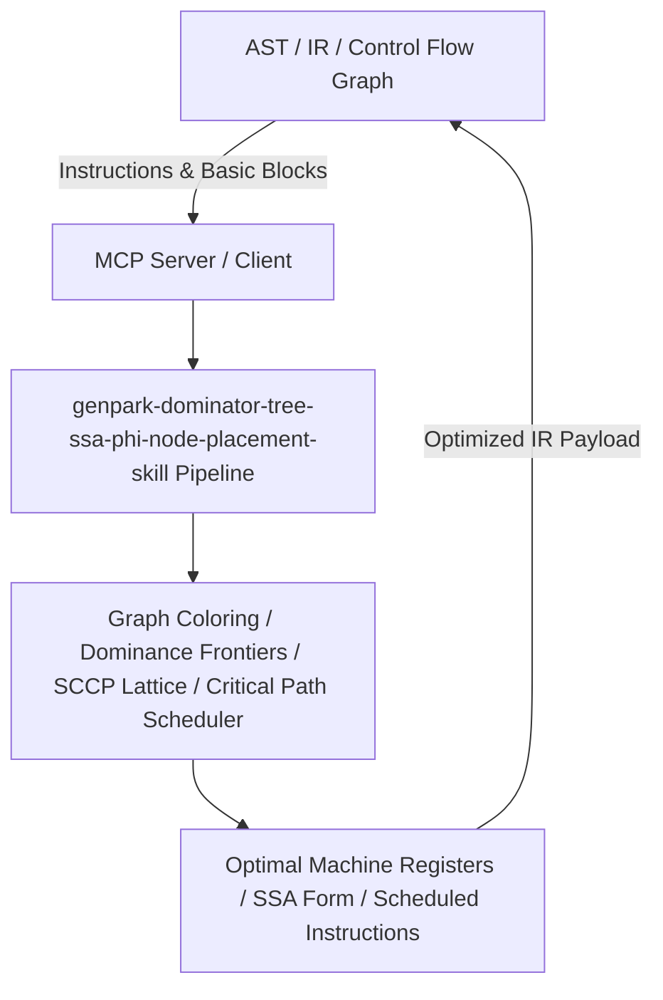

# genpark-dominator-tree-ssa-phi-node-placement-skill

[](https://github.com/alphaparkinc/genpark-dominator-tree-ssa-phi-node-placement-skill)
[](https://python.org)
[](#)
[](#)
[](LICENSE)

> SSA form construction engine calculating dominator trees, dominance frontiers, and minimal phi-node placements over Control Flow Graphs (CFG).

## Architecture Overview



## Features
- **0 External Pip Dependencies**: Pure Python standard library implementation.
- **MCP Protocol Ready**: Includes Model Context Protocol server script (`mcp_server.py`).
- **Production Standard**: Thoroughly tested dominance analysis, register allocation, and peephole rewriting.

## Quick Start
```bash
python example_usage.py
```
